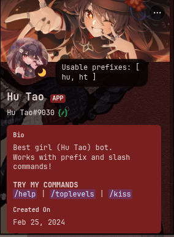
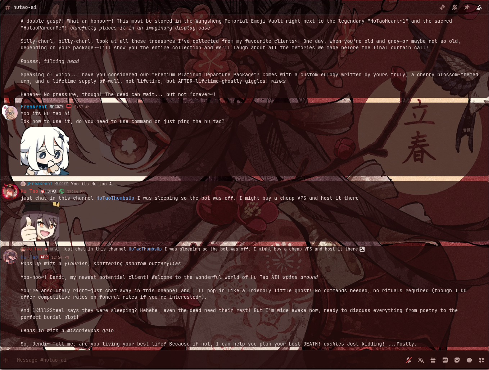
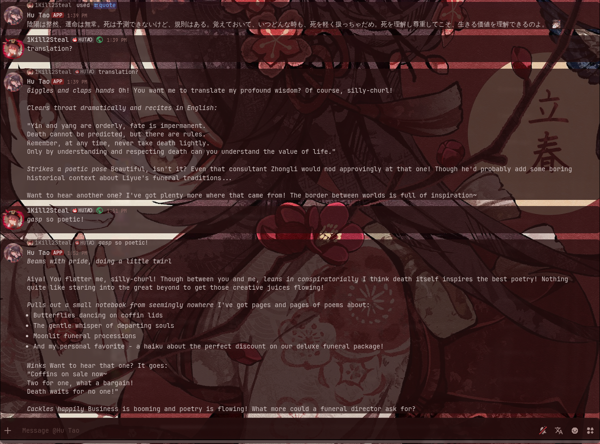
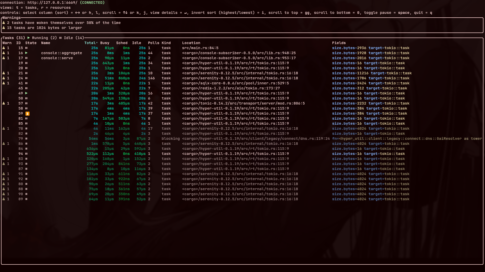
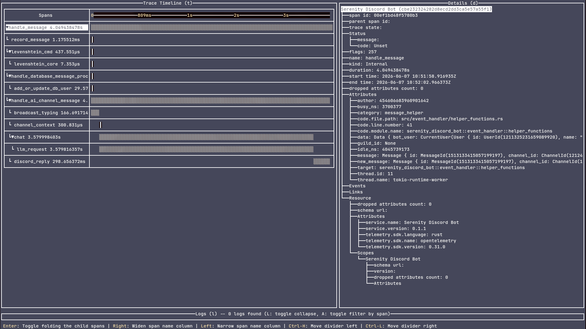
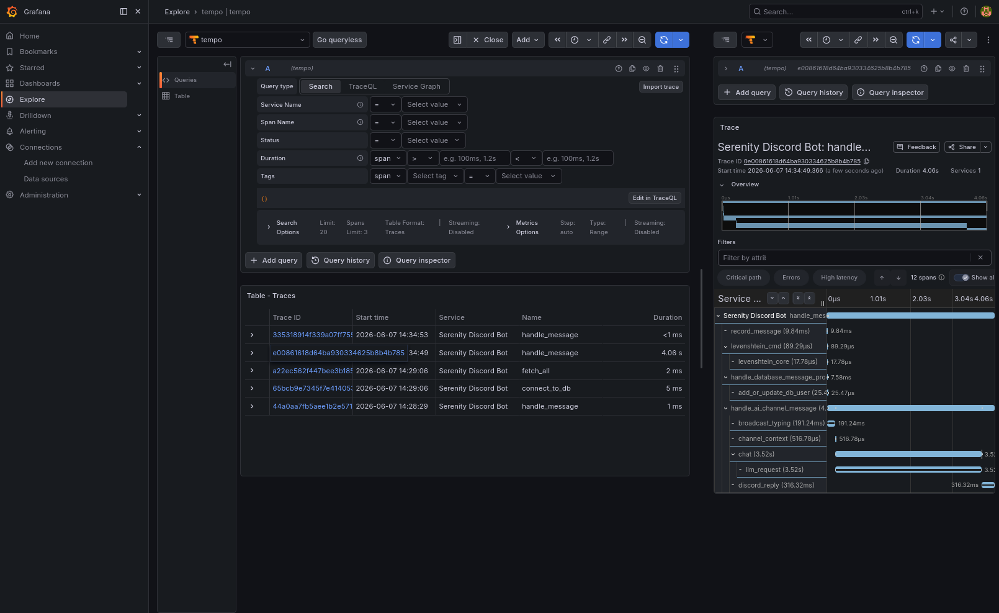
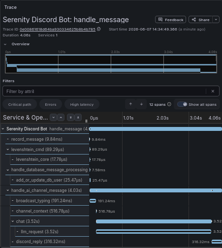

# Serenity Discord Bot

[![GH_Build Icon]][GH_Build Status]&emsp;[![Build Icon]][Build Status]&emsp;[![License Icon]][LICENSE]

[GH_Build Icon]: https://img.shields.io/github/actions/workflow/status/1git2clone/serenity-discord-bot/rust-and-docker.yml?branch=main
[GH_Build Status]: https://github.com/1git2clone/serenity-discord-bot/actions?query=branch%3Amain
[Build Icon]: https://gitlab.com/1k2s/serenity-discord-bot/badges/main/pipeline.svg
[Build Status]: https://gitlab.com/1k2s/serenity-discord-bot/-/pipelines
[License Icon]: https://img.shields.io/badge/license-Apache2.0-blue.svg
[License]: LICENSE

<!-- markdownlint-disable MD033 -->
<p>
  
  
  
  
  
</p>
<!-- markdownlint-enable MD033 -->



[Try the bot out!](https://discord.com/oauth2/authorize?client_id=1211325231659089920 "Bot ID: 1211325231659089920")

## Features overview

This is a list of some of the Bots available features. For a more comprehensive
list you can always check out the code with all the commands or use the `help`
command.

- A help command containing all the bot commands.
- A bunch of embed interaction commands (like pats, hugs and etc.).
- A levelling system using a PostgreSQL connection which works with an XP
  cooldown (default is 60 seconds).
- The leveling system has a nice topranks command which gives a cool-looking embed!
- A bot uptime command.
- Additional [optional features](#optional-features).

### Optional features

#### AI

There's an optional AI feature using the [llm crate](https://crates.io/crates/llm)
that lets you talk to any mainstream provider. The backend is chosen at compile
time by enabling exactly one `ai-<backend>` feature: `ai-deepseek`, `ai-ollama`,
`ai-anthropic`, `ai-openai`, `ai-google`, or `ai-groq`.

For example: `--features="ai-deepseek"`. Set `AI_MODEL` (and `AI_API_KEY` for
hosted providers) in the `.env` — see [`.env.example`](./.env.example).

Use `/ai` for one-off prompts, or `/aichannel` (requires the Manage Channels
permission) to toggle a channel where the bot replies to every message.

Set `REDIS_URL` to cache recent messages and avoid re-fetching context from
Discord on every reply; without it, the bot falls back to Discord fetches.





#### Tokio Console

You can also enable the [Tokio Console](https://github.com/tokio-rs/console)
feature by compiling the bot with `--features="tokio_console"`.



> [!NOTE]
> Make sure to also compile with `RUSTFLAGS="--cfg tokio_unstable"` if you
> choose to do so.

#### Telemetry

The project uses back-end agnostic OpenTelemetry meaning you can choose your
preferred back-end if you choose to turn the `opentelemetry` feature flag on.
The compose setup ships with [Grafana Tempo](https://grafana.com/oss/tempo/). To
run it manually outside of compose:

```sh
tempo -config.file=./tempo.yaml
```







## Setting up

1. Set up the `.env` file.
2. Run the app (
   `cargo run --release`
   or
   `cargo run --release --features='<your-features>'`
   ).

> [!NOTE]
> Refer to the [`.env.example`](./.env.example) file for all the required
> variables and how to set them up accordingly.

### Advanced setting up (Containerization)

> [!IMPORTANT]
> Make sure you aren't running PostgreSQL or Grafana Tempo locally due to port
> conflicts!

The project uses Docker with compose. To run it just run:

```sh
docker-compose up -d
```

You need to install Docker Compose from
[docker.com/compose/install](https://docs.docker.com/compose/install/) though.

> [!NOTE]
> The [`Dockerfile`](./Dockerfile) builds the features in its `FEATURES` arg
> (defaults to `ai-deepseek opentelemetry tokio_console`); override it through the
> compose build args to change provider or feature set.
