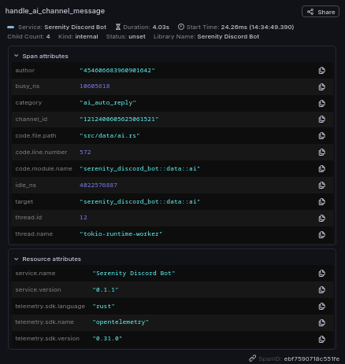

# Serenity Discord Bot

[![GH_Build Icon]][GH_Build Status]&emsp;[![Build Icon]][Build Status]&emsp;[![License Icon]][LICENSE]

[GH_Build Icon]: https://img.shields.io/github/actions/workflow/status/1git2clone/serenity-discord-bot/rust-and-docker.yml?branch=main
[GH_Build Status]: https://github.com/1git2clone/serenity-discord-bot/actions?query=branch%3Amain
[Build Icon]: https://gitlab.com/1k2s/serenity-discord-bot/badges/main/pipeline.svg
[Build Status]: https://gitlab.com/1k2s/serenity-discord-bot/-/pipelines
[License Icon]: https://img.shields.io/badge/license-Apache2.0-blue.svg
[License]: LICENSE

<!-- markdownlint-disable MD033 -->
<p>
  
  
  
  
  
</p>
<!-- markdownlint-enable MD033 -->


[Try the bot out!](https://discord.com/oauth2/authorize?client_id=1211325231659089920 "Bot ID: 1211325231659089920")

A Hu Tao-themed Discord bot built with [Serenity](https://github.com/serenity-rs/serenity) and [Poise](https://github.com/serenity-rs/poise). Responds to both slash and prefix commands (`hu`, `ht`), with persistent XP levelling backed by PostgreSQL and an optional AI persona that stays in character across a full channel conversation window.

## Features

- `/help` — lists every registered command
- Embed interaction commands: tieup, pat, hug, kiss, slap, punch, bonk, nom, kill, kick, bury, selfbury, peek, avatar, drive, chair, boom, quote
- XP levelling with a 60-second cooldown, stored in PostgreSQL — `/level` for a member's level, `/toplevels` for the server leaderboard
- `/reminder` — schedule a DM for later (`create`/`list`/`search`/`delete`), with a saveable default timezone (`/reminder timezone`, per-server or global) and browsable, paginated history
- `/age` — your or another member's account creation date
- `/cookie` — give someone a cookie
- `/uptime` — bot uptime
- Levenshtein-distance typo correction on unrecognised prefix commands

### Optional features

#### AI

An in-character Hu Tao persona powered by the [llm crate](https://crates.io/crates/llm), which supports every mainstream provider. The backend is chosen at compile time — enable exactly one of: `ai-deepseek`, `ai-ollama`, `ai-anthropic`, `ai-openai`, `ai-google`, `ai-groq`.

Set `AI_MODEL` and `AI_API_KEY` (hosted backends) in `.env` — see [`.env.example`](./.env.example) for all variables.

- `/ai` — one-off prompt in any channel or DM
- `/aichannel` — toggle a channel where the bot auto-replies to every message (requires Manage Channels)
- `/ai-review` — AI code review of a GitHub PR (see below)
- Set `REDIS_URL` to keep conversation context in Redis; without it the bot re-fetches recent messages from Discord on every reply


#### AI code review

`/ai-review run url:<repo-url> pr:<n>` — a Hu Tao-themed code review
agent shallow-clones the PR, inspects it with read-only tools (`list_files`,
`read_file`, `git_diff`, `git_log`), and posts a structured review as a PR
comment. Reviews run one at a time; without the setup below the command
replies that it isn't configured.

Setup, on top of the AI feature above:

1. `git` and the [GitHub CLI](https://cli.github.com/) (`gh`) on the host —
   the agent shells out to them. No `gh auth login` needed.
2. Create a GitHub OAuth App with Device Flow enabled (Settings → Developer
   settings → OAuth Apps). Set `GITHUB_OAUTH_CLIENT_ID` in `.env`. No client
   secret is required. Set `GITHUB_OAUTH_SCOPE` to `repo` to allow
   private-repo reviews (default is `public_repo`).
3. An administrator runs `/ai-review enable` in the server (and `/ai-review
   disable` to turn it off). Enabled servers are stored in PostgreSQL, so
   the setting survives restarts.
4. Optional: `AI_REVIEW_MAX_ITERATIONS` (default 20), `AI_REVIEW_TIMEOUT_SECS`
   (default 600), and `GITHUB_TOKEN_TTL_SECS` (default 3600) in `.env`.

On first use (and after the in-memory TTL or a bot restart) the requester
receives an ephemeral message with a github.com/login/device link and a short
code. Once they approve, the bot verifies they have push access to the target
repo before starting the review. The PR comment is posted as the requester's
GitHub identity. Tokens are never written to disk or a database — they are
held in memory only and expire after the TTL.

`AI_MODEL` must support function calling (`deepseek-chat` does). Private
repos additionally require a gh credential helper on the host for the
workspace's base-branch fetch; public repos work out of the box.

#### Tokio Console

Task-level async runtime inspection via [Tokio Console](https://github.com/tokio-rs/console):

```sh
RUSTFLAGS="--cfg tokio_unstable" cargo run --features tokio_console
```


#### Telemetry

Distributed tracing via OpenTelemetry — backend-agnostic, so you can point it at any OTLP-compatible collector. The compose setup ships with [Grafana Tempo](https://grafana.com/oss/tempo/) and Grafana pre-wired as the UI. To run Tempo manually (create `/var/tempo` once with your user as owner):

```sh
sudo mkdir -p /var/tempo && sudo chown $USER /var/tempo
tempo -config.file=./tempo.yaml
```




## Setting up

1. Copy `.env.example` to `.env` and fill in the values.
2. Have PostgreSQL running and reachable at `DATABASE_URL` — migrations run
   automatically at startup.
3. Run:

```sh
cargo run --release
# or, to enable specific features:
cargo run --release --features='<your-features>'
```

To run the telemetry stack (Grafana Tempo + Grafana) in containers while
running the bot natively:

```sh
docker-compose -f docker-compose.infra.yml up -d
```

### Docker Compose

The compose file brings up PostgreSQL, Redis, Grafana Tempo, and Grafana alongside the bot:

```sh
docker-compose up -d
```

> [!IMPORTANT]
> Make sure you aren't running PostgreSQL or Grafana Tempo locally due to port
> conflicts!

> [!NOTE]
> The [`Dockerfile`](./Dockerfile) builds with the features listed in its `FEATURES`
> arg (defaults to `ai-deepseek opentelemetry tokio_console`). Override via the
> compose build args to change provider or feature set.
