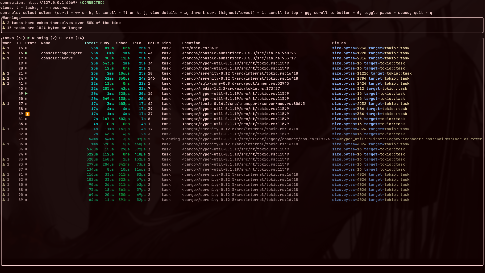
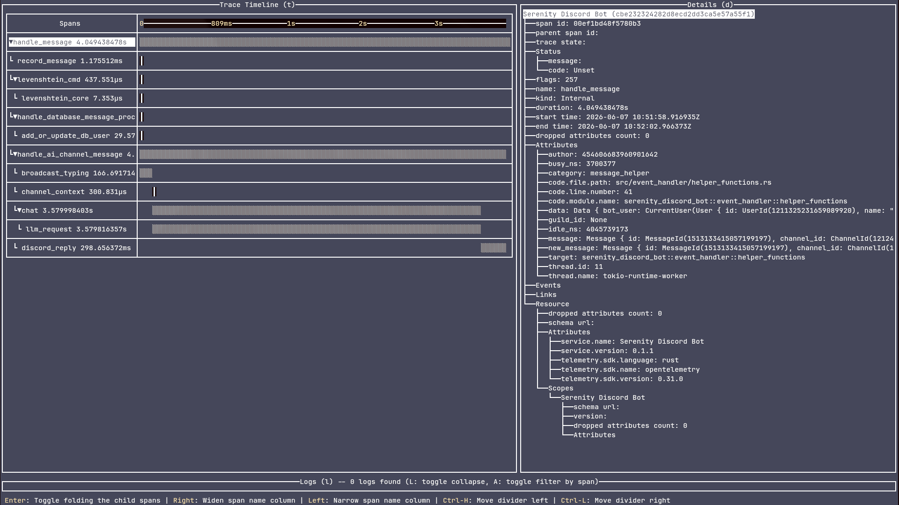
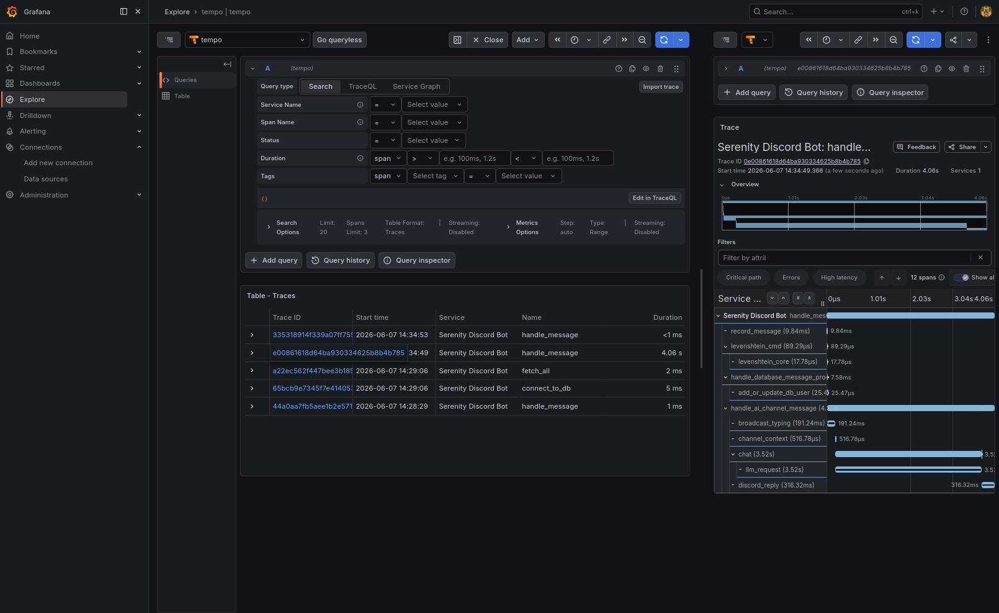
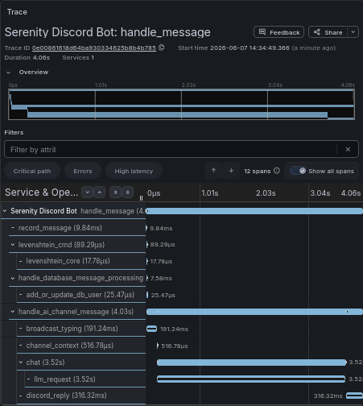
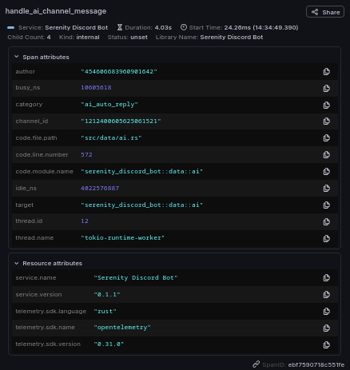

# Observability

The bot builds a layered `tracing_subscriber` in `main.rs`. The layers are a
console formatter, an optional Tokio Console layer, and an optional
OpenTelemetry OTLP exporter — each with its own filter.

## Console logging

The console formatter's default filter is `warn,serenity_discord_bot=info`.
With `RUST_LOG` unset, the infra crates (serenity, h2, hyper, the gateway) are
quieted to `warn` so the bot's own `info` logs are visible. Setting `RUST_LOG`
overrides the default entirely.

## The `category` span field

Every instrumented span carries a custom `category` field for filtering. Values
include `redis`, `ai_chat`, `llm`, `sql`, and `discord_command`.

The top-level `event_handler` is deliberately not instrumented: it fires for
every gateway event, including presence updates, so a span there would be pure
noise. Only handled events carry spans.

## Span field conventions

Dashboards group and filter on these fields, so their *shape* is part of the
contract — a field recorded two different ways splits every aggregate in half.

| Field | Form | Notes |
| --- | --- | --- |
| `guild_id` | `%` snowflake, `0` in DMs | Never `?guild_id` — the `Debug` of `Option<GuildId>` renders `Some(GuildId(123))`, which is a different value to the backend than `123` |
| `author` | `%` snowflake | Who sent the message or ran the command |
| `user_id` | `%` snowflake | The *subject* of a levelling query, which is not always the author (`/level @someone`) |
| `channel_id` | `%` snowflake | |
| `author_name` | `%` string | The unique Discord username, never the per-guild display name |
| `guild_name` | `%` string | `DM` when there is no guild, the snowflake when the cache is cold |
| `attachments` | integer | Number of attachments. No `%` — see below |
| `links` | integer | Number of `http(s)://` links in the message |

Counts are recorded as **`i64`, without a sigil**. Two separate traps meet
here, and both are silent:

- `%` and `?` stringify, and a string attribute cannot be summed — a
  `sum_over_time()` over one returns an empty series rather than an error.
- `u64` stringifies too. tracing-opentelemetry's span visitor implements
  `record_i64` and no `record_u64`, so an unsigned value falls through the
  `Visit` trait's default to `record_debug`.

`scripts/lint-span-fields.py` fails CI on an unsigned cast inside a
`#[tracing::instrument]` field list, because this is not a mistake worth
making twice.

Ids stay the key that dashboards group and link on; the `_name` fields are for
reading. Names are not stable — a user renames, a guild renames — so anything
that has to survive a rename keys on the snowflake.

`guild_id = 0` for DMs matches how the reminder tables already store a global
(non-guild) setting, and gives DM traffic a queryable value instead of an
absent field — a missing attribute cannot be told apart from a span that simply
never records one.

Spans do not carry message content or whole serenity structs. Use `skip_all`
and name the fields explicitly rather than `skip(ctx)`: `#[instrument]` records
every argument it isn't told to skip, so a bare `skip(ctx)` on a message
handler puts the entire `Message` — author object, avatar hashes, flags, and
the message text — into the trace backend on every message.

## Tokio Console

Task-level async runtime inspection through
[Tokio Console](https://github.com/tokio-rs/console). It is feature-gated and
needs the `tokio_unstable` cfg at build time:

```sh
RUSTFLAGS="--cfg tokio_unstable" cargo run --features tokio_console
```



## OpenTelemetry

The OTLP layer is feature-gated behind `opentelemetry` and exports over
gRPC/tonic, so it can point at any OTLP-compatible collector. It uses a
separate filter from the console layer:

```
warn,serenity_discord_bot=info,tokio=off,runtime=off
```

`tokio` and `runtime` are turned off here so that, when `tokio_unstable` is
also enabled, the runtime-span firehose does not bury application traces in the
trace backend.

The compose stack ships [Grafana Tempo](https://grafana.com/oss/tempo/) and
Grafana pre-wired as the UI. To bring up the telemetry backends without the bot:

```sh
docker-compose -f docker-compose.infra.yml up -d
```

To run Tempo manually, create `/var/tempo` once with your user as owner:

```sh
sudo mkdir -p /var/tempo && sudo chown $USER /var/tempo
tempo -config.file=./tempo.yaml
```








